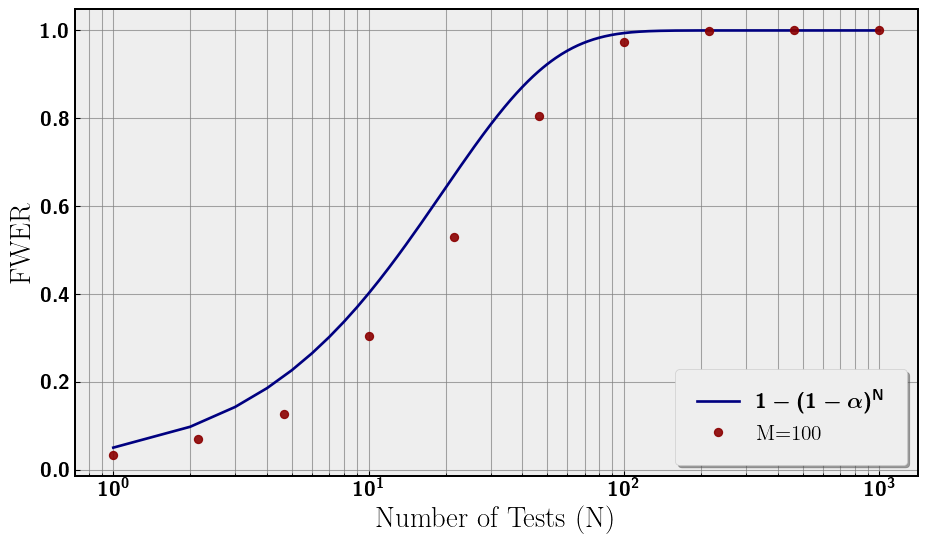
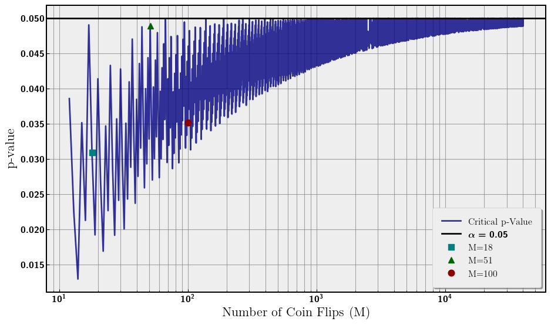
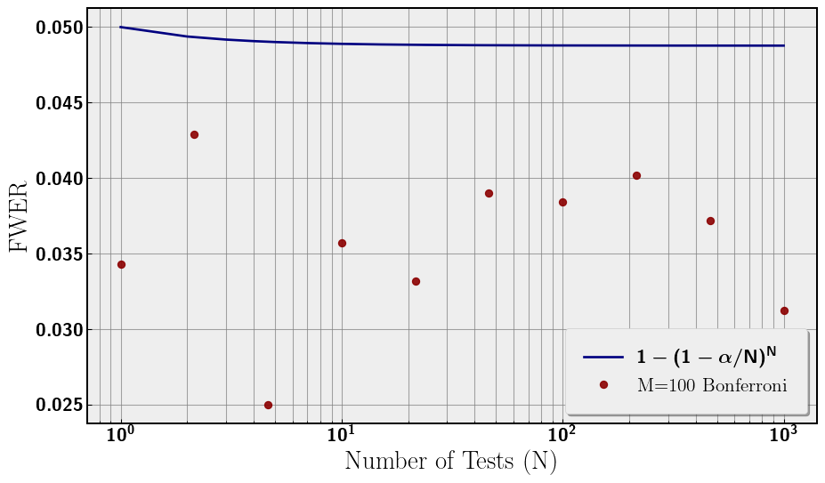

Evan Frangipane

## Abstract

In this article I will describe the multiple testing problem, simulate a
simple example, and outline a solution called the Bonferroni correction.

## What is the Multiple Testing Problem?

The main idea of the multiple testing problem is the more statistical
tests we perform during an analysis, the higher our false positive rate
(Type I Error). Imagine we choose our confidence level to be 95%,
essentially we are choosing our false positive rate to be 5% for one
test. If we test again, the probability of at least one false positive
is 1 − (0.95 ⋅ 0.95).

If we continue testing until *N*, we can rewrite the false positive
probablity (at least one) as 1 − (1 − 0.05)*N*. This
probability is called the family-wise error rate (FWER). As *N*
increases, the FWER increases to probability of 1. If we allow this
problem to get out of hand, we could be making false inferences.

## Outlining the Simulation

For our simulation we will be flipping fair coins. We are doing a
two-tailed test to see if the number of heads is significantly different
from the number of tails. Some parameters:

- *M* - number of coins being flipped in each test
- *α* = 0.05 - significance for each test
- *N* - number of tests performed
- *n* = 10000 - number of repetitions of each analysis

So, the total number of coins flipped in each analysis is
*M* ⋅ *N* ⋅ *n*. We choose *M* = {18, 51, 120}, and *N* ∈ \[1, 1000\]
for the following plots.

We plot the results of our analyses in
<a href="#fig-fwer" class="quarto-xref">Figure 1</a>. The false positive
rate (FWER) increases toward 1 with *N*. The three choices of *M* are
plotted along with the analytical curve. There is a discrepancy between
the analytical curve and the numerical simulations that is smallest for
*M* = 51. We will return to this in the next section. The relevant
feature is the monotonic increase in Type I Error.

## Discrepancy in FWER

Our *α* significance was chosen to be 0.05 for this analysis. However,
when we are dealing with coin flips we are using discrete data and not
continuous. This has consequences for what constitutes a significant
result for flipping *M* coins. For a significant result we need the
p-value of the number of heads (or tails hence two-tail test) to be the
largest number less than *α* = 0.05. We call this number of heads the
critical number of heads. However, due to discrete data, the critical
p-value can vary greatly rather than being exactly 0.05. One would
expect that as the number of coin flips increases, the critical p-value
should approach 0.05. The intuition being as we increase the number of
coins flipped we are filling in the discrete data set and approaching
continuum. We plot the critical p-value for increasing *M* coin flips in
<a href="#fig-crit" class="quarto-xref">Figure 2</a>. Additionally, we
also plot the three *M* values from the previous simulation and they
show the same hierarchy as seen in
<a href="#fig-fwer" class="quarto-xref">Figure 1</a>. The closer the
critical p-value is to 0.05, the closer the FWER is to
1 − (1 − *α*)*N*.

## Correcting Significance

A simple solution to this problem is to scale our choice of *α* for each
test by the number of tests. The simplest correction is the Bonferroni
correction, which is simply *α* → *α*/*N*. This comes from taking the
Taylor Expansion of the FWER equation with small parameter *α*.

1 − (1 − *α*)*N* → 1 − (1 − *N* ⋅ *α* + 𝒪(*α*2)) = *N* ⋅ *α* + 𝒪(*α*2)

Given this expansion, a natural redefinition of *α* is *α* = *α*/*N*
such that the first term in the expansion is our new *α* = 0.05. This
redefinition bounds the FWER to 0.05 rather than asymptoting to 1. Now
the entire analysis has a significance of 0.05, while each individual
test has a smaller significance scaled by the number of tests. Now, we
redo the analysis with our new significance to confirm that FWER is
around or less than 0.05. This can be seen in
<a href="#fig-fwer-bon" class="quarto-xref">Figure 3</a>. Notice that
there is no clear hierarchy between the three choices of *M*, this can
be explained by <a href="#fig-crit" class="quarto-xref">Figure 2</a>
again, where this time because *α* depends on *N*, the critical p-values
will vary with *N* and thus the hierarchy will vary.

